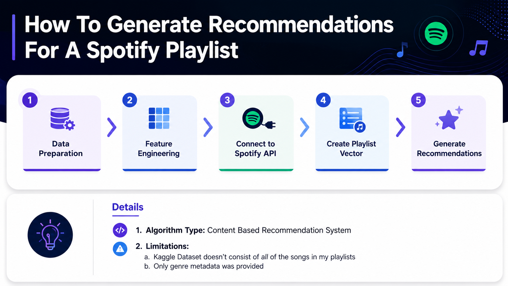
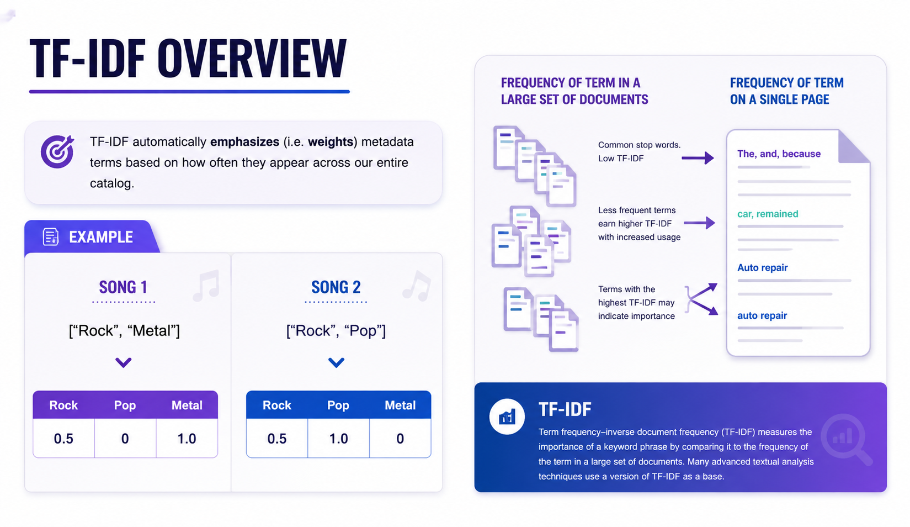
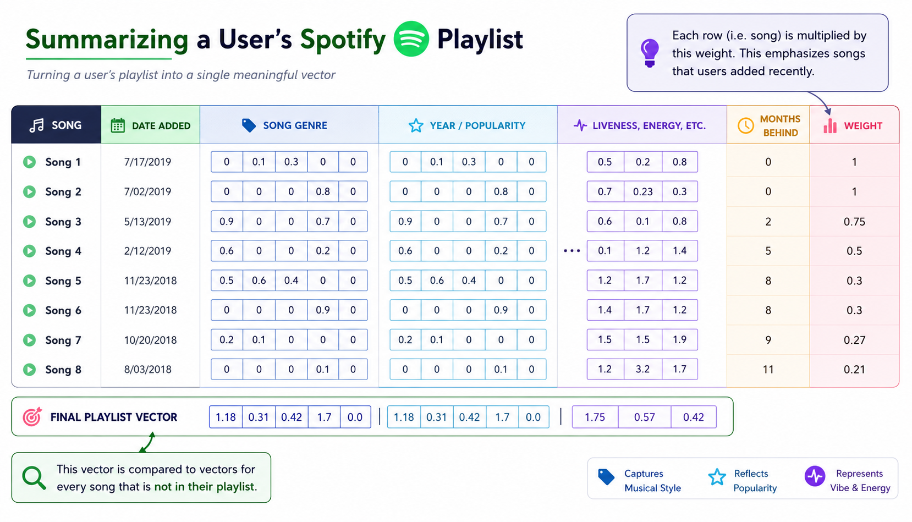
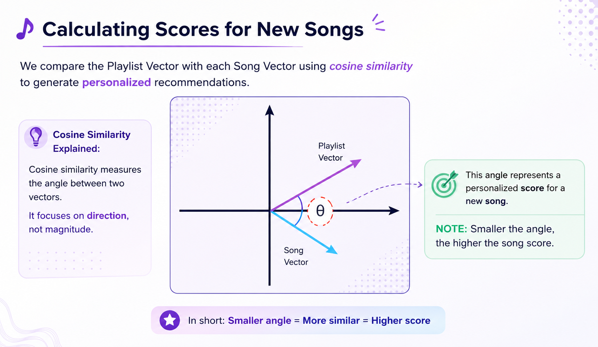

<h1 align="center">
🎵 Spotify Recommendation Engine
</h1>

<p align="center">
A Content-Based Music Recommendation System that generates personalized song recommendations using Spotify metadata, TF-IDF, Feature Engineering, and Cosine Similarity.
</p>

<p align="center">

</p>

---

## 🚀 Features

✅ Content-Based Recommendation System

✅ Spotify API Integration

✅ Feature Engineering

✅ TF-IDF Genre Encoding

✅ Playlist Vector Creation

✅ Cosine Similarity Ranking

✅ Personalized Song Recommendations

---

## 📌 Project Workflow

```text
Spotify Dataset
        │
        ▼
Data Cleaning
        │
        ▼
Feature Engineering
        │
        ▼
Spotify API
        │
        ▼
Playlist Vector
        │
        ▼
Cosine Similarity
        │
        ▼
Recommended Songs
```

---

# 📂 Project Structure

```bash
Spotify-Recommendation-Engine/
│
├── data/
│   ├── data.csv
│   ├── data_by_artist.csv
│   ├── data_by_genres.csv
│   ├── data_by_year.csv
│   └── data_w_genres.csv
│
├── images/
│   ├── process_2.png
│   ├── summarization_2.png
│   ├── tfidf_4.png
│   └── cosine_sim_2.png
│
├── spotify-recommendation-engine.ipynb
└── README.md
```

---

# ⚙️ Technologies Used

| Technology | Purpose |
|------------|----------|
| Python | Core Programming |
| Pandas | Data Processing |
| NumPy | Numerical Computing |
| Scikit-Learn | TF-IDF & Cosine Similarity |
| Spotipy | Spotify API |
| Matplotlib | Visualization |
| Jupyter Notebook | Development |

---

# 🧠 Recommendation Pipeline


---

# 📊 Feature Engineering

The recommendation model combines multiple types of features:

- 🎵 Genre (TF-IDF)
- 📅 Release Year
- ⭐ Popularity
- 🎧 Audio Features
- 💃 Danceability
- ⚡ Energy
- 🎤 Speechiness
- 🎹 Instrumentalness
- 😊 Valence
- 🔥 Tempo

---

# 📝 TF-IDF Genre Representation



Genres are converted into weighted numerical vectors using TF-IDF.

This helps the model understand:

- Common Genres
- Rare Genres
- Artist Similarity

---

# 🎼 Playlist Vector

Instead of comparing every song individually, the playlist is summarized into a single vector.



Recent songs receive higher weights than older songs.

---

# 📐 Cosine Similarity

Recommendations are generated by comparing:

```
Playlist Vector
          VS
Song Vector
```

using Cosine Similarity.



Higher similarity score → Better recommendation.

---

# 📈 Recommendation Algorithm

```python
Playlist
      │
      ▼
Feature Extraction
      │
      ▼
Playlist Vector
      │
      ▼
Cosine Similarity
      │
      ▼
Top N Songs
```

---

# 📦 Installation

Clone the repository

```bash
git clone https://github.com/yourusername/Spotify-Recommendation-Engine.git
```

Go inside the project

```bash
cd Spotify-Recommendation-Engine
```

Install dependencies

```bash
pip install -r requirements.txt
```

---

# 🔑 Spotify API Setup

Create an app on

https://developer.spotify.com/dashboard

Set your credentials

```python
client_id = "YOUR_CLIENT_ID"
client_secret = "YOUR_CLIENT_SECRET"
```

or

```bash
export SPOTIPY_CLIENT_ID=YOUR_CLIENT_ID
export SPOTIPY_CLIENT_SECRET=YOUR_CLIENT_SECRET
```

---

# ▶️ Run

Open

```
spotify-recommendation-engine.ipynb
```

Run every cell.

---

# 📸 Screenshots

## Recommendation Workflow


---

## Playlist Vector


---

## TF-IDF


---

## Cosine Similarity


---

# 📊 Future Improvements

- Hybrid Recommendation System
- Deep Learning Recommendation Model
- Collaborative Filtering
- Streamlit Deployment
- Real-Time Playlist Generation
- Spotify OAuth Login

---

# 🤝 Contributing

Contributions are welcome!

1. Fork the repository

2. Create your feature branch

3. Commit your changes

4. Push to the branch

5. Open a Pull Request

---

# ⭐ Support

If you found this project useful,

⭐ Star the repository

🍴 Fork it

📢 Share it

---

# 👨‍💻 Author

**Prashast Srivastava**

Made with ❤️ using Python & Spotify API.
